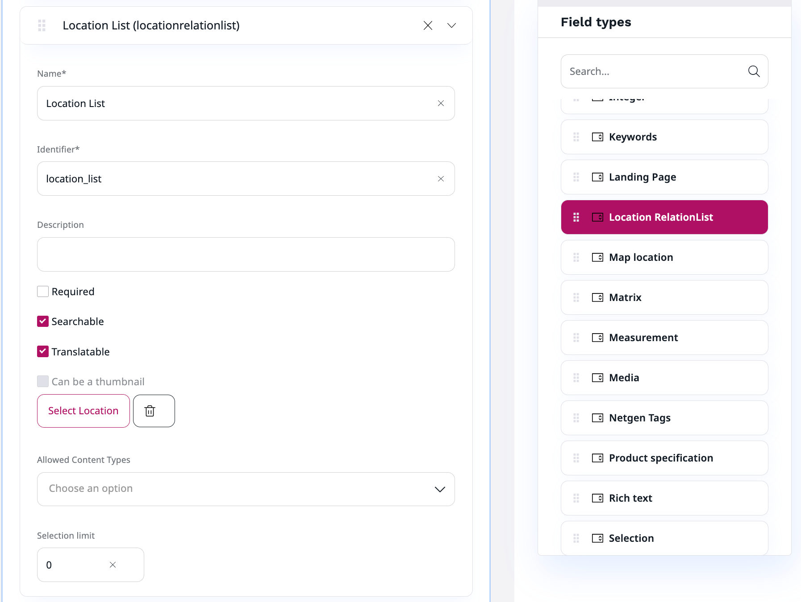
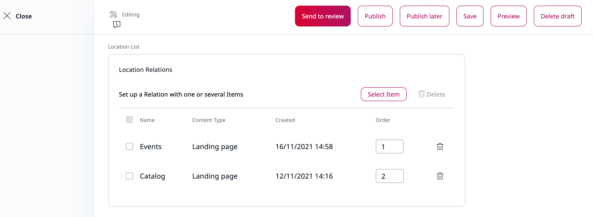

[](https://github.com/arfaram/ibexa-location-relationlist-fieldtype/tags)
[](https://packagist.org/packages/arfaram/ibexa-location-relationlist-fieldtype)
[](https://github.com/arfaram/ibexa-location-relationlist-fieldtype/blob/master/LICENSE)

# Ibexa location relationlist fieldtype Bundle

Ibexa standard `Content relations (multiple)`fieldtype provides always the **main** location Id of selected contents which can be a bottleneck if you need to provide content links in multisites setup. This bundle provides a new `Location relationList (multiple)` fieldtype based on current content selection in the UDW (Universal discovery widget). The content link provided in the frontend is siteaccess aware.

## Requirement

Ibexa **4.x +**
 
## Installation

```bash
composer require arfaram/ibexa-location-relationlist-fieldtype
```

- Activate the Bundle in `bundles.php`

```php
    Ibexa\LocationRelationListFieldTypeBundle\IbexaLocationRelationListFieldTypeBundle::class => ['all' => true],
```

### Translation

#### fieldtype name
If the new fieldtype is shown as `location.name` then run
```
php bin/console translation:extract en --config=ibexa_location_relation_list_fieldtype
```

## Usage

```
    
        {{ ibexa_render_field(content, '<FIELD-TYPE-IDENTIFIER>') }}
    
```

## Screenshots






